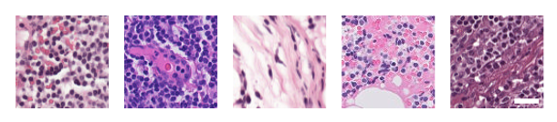
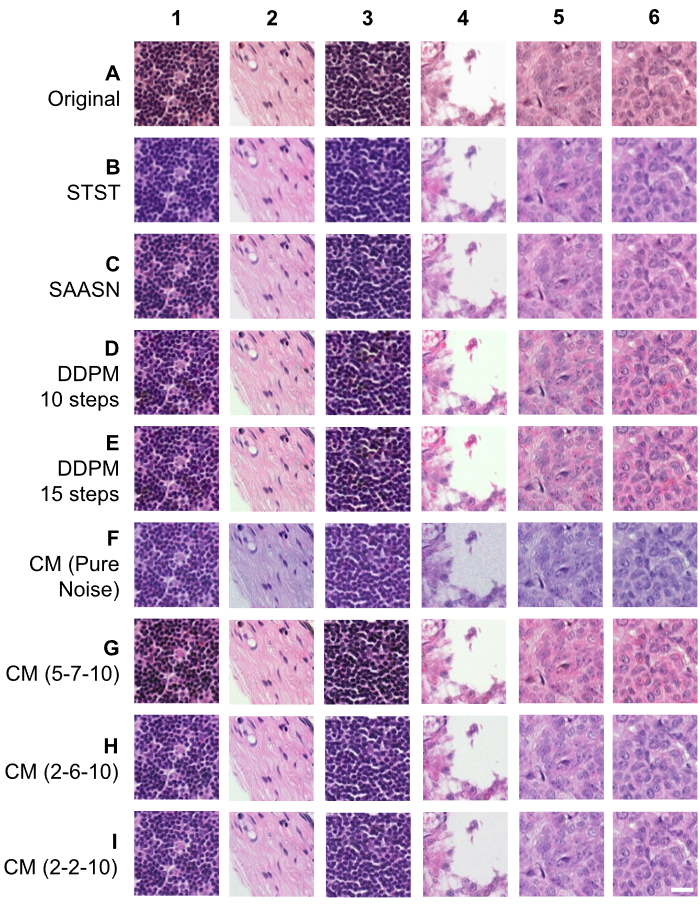

# Stain Normalization of Lymph Node Histology Images using Consistency Models



This repository consists of training and sampling code for consistency models, an architecture proposed by Song et al. [1], which has been modified for stain normalization on the Camelyon17-WILDS dataset [2]. This codebase is heavily based on the original consistency models repo [3], with snippets from [4] and [5].

## Modifications
Key modifications include:
- Compatibility with Camelyon17-WILDS
- Grayscale conditioning for preserving histological features
- SDEdit sampling
- Incorporation of improved consistency models (iCMs)

## Dependencies

The base environment used was created from Open-CE v1.6.1. The package listing is [here](https://ftp.osuosl.org/pub/open-ce/1.6.1/). Packages can be installed by running
```
pip install -r requirements-opence-1.6.1.txt -r requirements.txt
```
Experiments were run on an IBM POWER9 server and 16 GB NVIDIA GPU, provided by the National Center for Supercomputing Applications at the University of Illinois [6].

## Dataset

The Camelyon17-WILDS dataset should be downloaded such that it has the following path `./data/camelyon17_v1.0/patches/`. Installation instructions can be found at [https://wilds.stanford.edu/get_started](https://wilds.stanford.edu/get_started/) and downloaded directly at [https://worksheets.codalab.org/bundles/0xe45e15f39fb54e9d9e919556af67aabe](https://worksheets.codalab.org/bundles/0xe45e15f39fb54e9d9e919556af67aabe).

The training and test splits used are in `./splits/`.

## Training and Sampling

To train the consistency model, run ` bash ./scripts/train.sh`. To perform stain normalization, run `bash ./scripts/sample.sh`.

## Results

To learn more about the results from this work, visit [https://peterhsu48.github.io/consistency-stainnorm](https://peterhsu48.github.io/consistency-stainnorm/).




## Acknowledgements

This work utilizes resources supported by the National Science Foundation’s Major Research Instrumentation program, grant #1725729, as well as the University of Illinois at Urbana-Champaign.

## References

[1] Y. Song, P. Dhariwal, M. Chen, and I. Sutskever, “Consistency Models,” May 31, 2023, arXiv: arXiv:2303.01469. doi: 10.48550/arXiv.2303.01469.

[2] P. W. Koh et al., “WILDS: A Benchmark of in-the-Wild Distribution Shifts,” July 16, 2021, arXiv: arXiv:2012.07421. doi: 10.48550/arXiv.2012.07421.

[3] https://github.com/openai/consistency_models

[4] https://github.com/ermongroup/SDEdit

[5] https://github.com/Kinyugo/consistency_models/tree/main

[6] V. Kindratenko et al., “HAL: Computer System for Scalable Deep Learning,” in Practice and Experience in Advanced Research Computing 2020: Catch the Wave, in PEARC ’20. New York, NY, USA: Association for Computing Machinery, July 2020, pp. 41–48. doi: 10.1145/3311790.3396649.